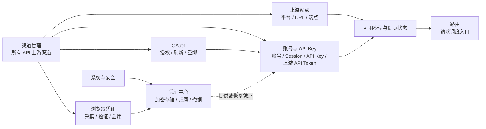

# 🚀 快速上手

本文档帮助你在 10 分钟内完成 Metapi 的首次部署。

[返回文档中心](./README.md)

---

## 前置条件

按你的使用场景准备对应环境：

| 场景 | 推荐方式 | 需要准备 |
|------|----------|----------|
| 云服务器 / NAS / 家用主机长期运行 | Docker / Docker Compose | Docker 与 Docker Compose |
| 免费云部署（24h 在线） | Render + TiDB + UptimeRobot | 注册 Render / TiDB Cloud / UptimeRobot 免费账号，详见 [Render 部署指南](./deployment.md#render-一键部署免费-24h-运行) |
| 个人电脑本地使用 | 桌面版安装包 | 从 [Releases](https://github.com/cita-777/metapi/releases) 下载对应系统的桌面安装包 |
| 二次开发 / 调试 | 本地开发 | Node.js 20+ 与 npm |

> [!NOTE]
> - 当前不再把 `Release` 压缩包 + Node.js 运行时作为独立部署路径。
> - 想直接运行成品，请用 Docker 或桌面版；想改代码，请走本地开发流程。

## 方式一：Docker Compose 部署（推荐）

### 1. 创建项目目录

```bash
mkdir metapi && cd metapi
```

### 2. 创建 `docker-compose.yml`

```yaml
services:
  metapi:
    image: 1467078763/metapi:latest
    ports:
      - "4000:4000"
    volumes:
      - ./data:/app/data
    environment:
      ACCOUNT_CREDENTIAL_SECRET: ${ACCOUNT_CREDENTIAL_SECRET:?ACCOUNT_CREDENTIAL_SECRET is required}
      AUTH_TOKEN: ${AUTH_TOKEN:-}
      AUTH_TOKEN_HASH: ${AUTH_TOKEN_HASH:-}
      ADMIN_CREDENTIAL_BOOTSTRAP_REQUIRED: "true"
      PROXY_TOKEN: ${PROXY_TOKEN:?PROXY_TOKEN is required}
      CHECKIN_CRON: "0 8 * * *"
      BALANCE_REFRESH_CRON: "0 * * * *"
      PORT: ${PORT:-4000}
      DATA_DIR: /app/data
      TZ: ${TZ:-Asia/Shanghai}
    restart: unless-stopped
```

### 3. 设置凭据并启动

```bash
# AUTH_TOKEN = 首次初始化管理员登录凭据（第一次登录时输入这个值）
export AUTH_TOKEN=your-admin-token
# ACCOUNT_CREDENTIAL_SECRET = 独立的 Vault/账号凭证加密根密钥，不要与 AUTH_TOKEN 相同
export ACCOUNT_CREDENTIAL_SECRET=your-32-byte-random-secret
# PROXY_TOKEN = 下游客户端调用 /v1/* 使用的令牌
export PROXY_TOKEN=your-proxy-sk-token
docker compose up -d
```

### 4. 访问管理后台

打开 `http://localhost:4000`，首次使用 `AUTH_TOKEN` 的值登录。

> [!TIP]
> 初始管理员登录凭据就是启动时配置的 `AUTH_TOKEN`。首次验证后，数据库只保留 Argon2id 哈希。
> 也可以只提供 `AUTH_TOKEN_HASH`；数据库完成初始化后，后续启动可以移除 `AUTH_TOKEN`。若数据目录为空且两者都未提供，Compose 会拒绝启动。
> 如果未显式设置（非 Compose 场景），默认值为 `change-me-admin-token`（仅建议本地调试）。
> 若你在后台「设置」里修改过管理员登录凭据，所有现有管理会话会被撤销，后续请使用新凭据登录。
>
> 登录后可在「系统设置 → 管理员安全」启用可选 TOTP。恢复码只显示一次，请离线保存；TOTP 只约束 WebUI 登录，显式管理脚本 Bearer 仍使用当前管理员登录凭据。

## 方式二：桌面版启动（Windows / macOS / Linux）

如果你是在个人电脑上本地使用，请直接下载桌面版安装包：

1. 打开 [Releases](https://github.com/cita-777/metapi/releases) 下载与你系统匹配的桌面安装包
2. 安装并启动 Metapi Desktop
3. 桌面壳会自动启动本地服务并保存数据，无需手动准备 Node.js 环境

Linux 安装包选择建议：

- Fedora / RHEL / CentOS / openSUSE 优先下载 `.rpm`
- Debian / Ubuntu / Linux Mint 优先下载 `.deb`
- 其他发行版或想免安装直接运行时，可下载 `.AppImage`

| 项目 | 说明 |
|------|------|
| 管理界面 | 应用启动后会直接打开桌面窗口，不需要假设固定的 `http://localhost:4000` |
| 本地后端地址 | 桌面版内置服务默认监听 `0.0.0.0:4000`；桌面窗口和本机 curl 可继续使用 `http://127.0.0.1:4000`，局域网其他设备请使用当前机器的实际 IP + `4000`；如需改端口，可显式设置 `METAPI_DESKTOP_SERVER_PORT` |
| 数据目录 | 保存在 `app.getPath('userData')/data`，不是仓库里的 `./data` |
| 日志目录 | 保存在 `app.getPath('userData')/logs`；托盘菜单提供 `Open Logs Folder` |

> [!IMPORTANT]
> 桌面版首次启动时，如果你没有额外注入 `AUTH_TOKEN`，默认管理员登录凭据就是 `change-me-admin-token`。
> 首次登录后建议立即到「设置」里改成你自己的强凭据；WebUI 使用 HttpOnly Cookie，会清理旧版 localStorage 管理令牌。

> [!TIP]
> - Windows 下常见路径是 `%APPDATA%\Metapi\data` 和 `%APPDATA%\Metapi\logs`。
> - 如果没有额外覆盖端口，本机其他客户端可以直接连接 `http://127.0.0.1:4000`。
> - Linux 用户建议优先选原生包：Fedora 系列用 `.rpm`，Debian/Ubuntu 系列用 `.deb`。

> [!WARNING]
> **端口冲突排障：** 桌面版默认使用 `4000` 端口；如果该端口被其他应用占用：
> - 设置环境变量 `METAPI_DESKTOP_SERVER_PORT=<指定端口>` 改到一个空闲端口
> - 或关闭占用 `4000` 的应用后重启 Metapi Desktop

> [!NOTE]
> 服务器部署统一推荐 Docker / Docker Compose，不再提供裸 Node.js 的 Release 压缩包。

## 方式三：本地开发启动

```bash
git clone https://github.com/cita-777/metapi.git
cd metapi
npm install
npm run db:migrate
npm run dev
```

- 前端地址：`http://localhost:5173`（Vite dev server）
- 后端地址：`http://localhost:4000`
- 这是源码开发流程，不是免 Docker 的成品部署包

## 首次使用流程

完成部署后，按以下顺序配置：

### 先理解渠道管理

现在所有上游 API 接入都从左侧的 **渠道管理** 进入。渠道管理是唯一的上游业务入口，内部按职责分成几个视图：

| 渠道管理视图 | 它负责什么 | 是否直接参与每次请求选路 |
|------|------------|----------------------|
| **渠道总览** | 汇总每个上游渠道的站点、连接、OAuth、凭证和 API 端点状态 | 否，负责查看和进入具体管理面 |
| **上游站点** | 定义平台、主 URL、API 端点池、站点状态和全局权重 | 是，提供最终请求地址和站点健康信号 |
| **账号与 API Key** | 管理面板账号及其 Session、直连 API Key，以及面板账号签发的上游 API Token | 是，路由通道最终绑定到这里的连接 |
| **OAuth** | 通过 Provider 授权创建、刷新或重绑 OAuth 连接 | 间接参与，负责连接的创建和维护 |
| **浏览器凭证** | 管理需要浏览器或本地连接器协助采集的凭证任务 | 间接参与，完成后写入凭证中心并可启用到连接 |

跨渠道和系统集成使用的秘密统一在 **系统与安全 → 凭证中心** 治理。凭证中心负责加密存储、归属、过期和撤销；渠道管理只保留与上游接入直接相关的工作流和站点级凭证统计。

路由仍然是独立的运行时决策入口，它只消费渠道管理产生的可用连接和站点健康状态：



日常接入顺序是：进入 **渠道管理**，先在「上游站点」建立渠道，再按手上的凭证选择「账号与 API Key」或「OAuth」；需要采集浏览器登录态时使用「浏览器凭证」，需要统一查看、录入或撤销秘密时进入 **系统与安全 → 凭证中心**。配置完成后，到「路由」决定模型请求如何调度。

> [!TIP] 从 ALL-API-Hub 迁移（可选）
> 如果你使用过 ALL-API-Hub，Metapi 兼容其导出的备份设置，可直接导入，无需手动逐项配置。
>
> 导入后刷新账号状态时，个别面板账号的登录 Session 可能已经过期。点击重新绑定，并按下面步骤 2 获取 Access Token 或 Cookie 即可。
>
> 

### 步骤 1：在渠道管理中添加上游站点

进入 **渠道管理 → 上游站点**，添加你使用的上游中转站：

- 填写站点名称（自己想怎么取就怎么取）和 URL
- 按你手上的上游形态选择：
  - 有后台面板：`new-api` / `one-api` / `one-hub` / `done-hub` / `veloera` / `anyrouter` / `sub2api`
  - 通用兼容接口：`openai` / `claude` / `gemini` / `cliproxyapi`
  - 官方入口：直接在下拉里选对应**官方预设**，例如阿里云 / 智谱 / 豆包 Coding Plan，DeepSeek，Moonshot，MiniMax，ModelScope
- 平台通常可自动检测；如果因为防护页、反向代理或特殊路径导致检测失败，再手动选择。
- 可选是否开启系统代理，方便国内机器访问国外中转站。
- 可选站点权重，站点权重越大，路由将更加频繁使用这个站点的模型。
- 如果这个站点的控制台 URL 和真实 API 请求地址不同，不要直接把主站点 URL 改掉，而是在表单下方补「API 请求地址池」。

> [!IMPORTANT]
> 通用平台常见写法是填控制台地址或 provider base URL；但如果你选的是**官方预设**，请保留预设自动带出的完整路径，哪怕它本来就包含 `/v1`、`/anthropic` 或 `/api/coding/...`。

如果你不确定该选哪个平台或预设，先看 [上游接入](/upstream-integration)。


### 步骤 2：在渠道管理中添加连接（账号 / API Key / OAuth）

这一步不要再死记“所有站点都先加账号”。现在推荐按场景分流：

#### 2A. 面板型站点：添加账号 / Session

进入 **渠道管理 → 账号与 API Key**，为每个站点添加已注册的账号：


- 填入用户名和访问凭证

  

- 系统会自动登录并获取余额信息

  

- 启用自动签到（如站点支持）

适合这一分支的平台：

- `new-api`
- `one-api`
- `one-hub`
- `done-hub`
- `veloera`
- `anyrouter`
- `sub2api`

#### 2B. 兼容接口 / 官方预设 / CPA：添加 API Key

进入 **渠道管理 → 账号与 API Key**，为站点添加你的 API Key：


适合这一分支的平台：

- `openai`
- `claude`
- `gemini`
- `cliproxyapi`
- 所有官方预设（Coding Plan、DeepSeek、Moonshot、MiniMax、ModelScope 等）

#### 2C. Provider 原生授权：走 OAuth 管理

如果你要接的是：

- Codex
- Claude provider 账号
- Gemini CLI
- Antigravity

那就不要在这里手填普通账号，而是进入 **渠道管理 → OAuth** 完成授权，详见 [OAuth 管理](/oauth)。

### 步骤 3：同步或创建上游 API Token（可选，仅面板型站点）

进入 **渠道管理 → 账号与 API Key → 上游 API Token**：

- 点击「同步上游 Token」，从选中的面板账号拉取已有 API Token

- 点击「在上游创建 Token」，通过面板 API 在上游创建新 Token，并自动同步到本地。

  

这里的 Token 不是登录 Session，也不是直连 API Key；它是面板账号在上游签发、供模型路由实际调用的凭证。如果你走的是 API Key-only 或 OAuth 流程，这一步通常不是必需的。

### 步骤 4：路由管理

进入 **路由管理**：

- 系统会自动发现模型并生成路由规则
- 点击右上角的刷新选中概率可以显示并将概率载入缓存中
- 可以手动调整通道的优先级和权重
- 关于路由权重参数调优，参考 [配置说明 → 智能路由](/configuration#智能路由)
- 左侧可以进行品牌、站点、接口等的筛选，如下图所示：


- **可以通过创建群组，从而对上游模型进行匹配和重定向，如果建立下图群组，下游访问Metapi时获取的claude-opus-4-6模型将在命中样本中智能选取，日志中可以看见映射。** 

- **可以在使用日志中看见下游的请求模型和实际分配给下游使用的模型**

  

### 步骤 5：验证代理

**Metapi还有更多功能，可以在设置中寻找，请尽情探索，有建议可以提出Issue改进。**

按运行方式选择验证入口：

| 运行方式 | 管理界面 | 代理接口基地址 |
|----------|----------|----------------|
| Docker / Docker Compose | `http://localhost:4000` | `http://localhost:4000` |
| 本地开发 | `http://localhost:5173` | `http://localhost:4000` |
| 桌面版 | 直接使用桌面窗口 | 默认 `http://127.0.0.1:4000`；如果设置了 `METAPI_DESKTOP_SERVER_PORT`，则按日志里的实际端口访问，局域网其他设备改用当前机器 IP + 同一端口 |

### Docker / 本地开发：直接用 curl 验证

```bash
# 检查模型列表
curl -sS http://localhost:4000/v1/models \
  -H "Authorization: Bearer your-proxy-sk-token"

# 测试对话
curl -sS http://localhost:4000/v1/chat/completions \
  -H "Authorization: Bearer your-proxy-sk-token" \
  -H "Content-Type: application/json" \
  -d '{"model":"gpt-4o-mini","messages":[{"role":"user","content":"hi"}]}'
```

### 桌面版：默认直接用 4000 验证

打开托盘菜单的 `Open Logs Folder`，在最新日志里查找类似下面的启动信息：

```text
Dashboard: http://127.0.0.1:4000
Proxy API: http://127.0.0.1:4000/v1/chat/completions
```

如果你没有覆盖端口，可直接执行：

```bash
curl -sS http://127.0.0.1:4000/v1/models \
  -H "Authorization: Bearer your-proxy-sk-token"
```

如果你显式设置了 `METAPI_DESKTOP_SERVER_PORT`，再把上面的 `4000` 替换成日志里的实际端口。返回正常响应，说明代理链路已经可用。

如果你要从同一局域网的其他设备访问桌面版，把上面的 `127.0.0.1` 替换成这台电脑的实际局域网 IP，并确认系统防火墙已放行对应端口。

## 下一步

- [上游接入](./upstream-integration.md) — 当前代码支持哪些上游、默认该走哪个连接分段
- [部署指南](./deployment.md) — 反向代理、HTTPS、升级策略
- [配置说明](./configuration.md) — 详细环境变量与路由参数
- [客户端接入](./client-integration.md) — 对接 Open WebUI、Cherry Studio 等
